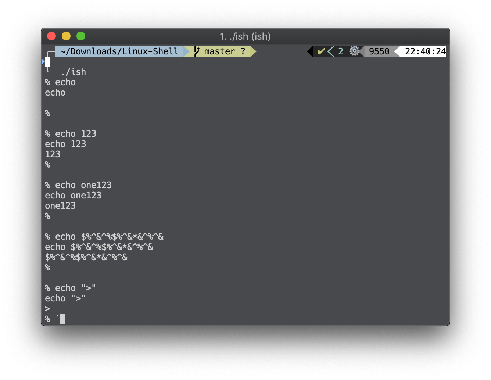
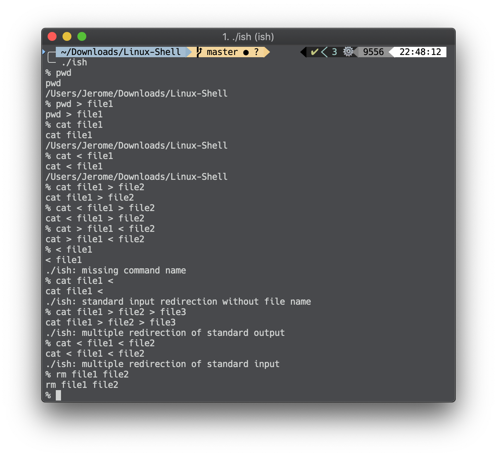
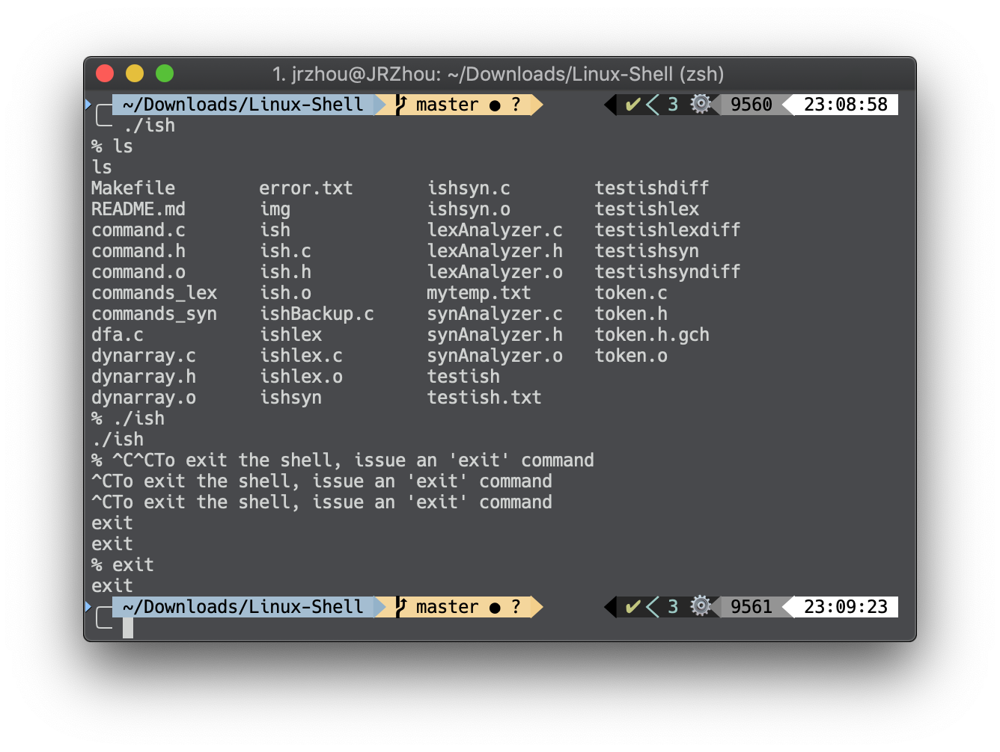
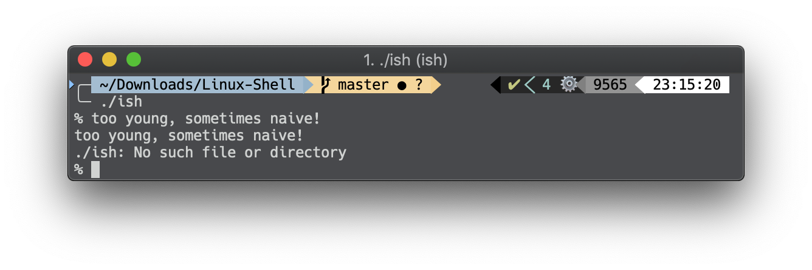

# iShell
`iShell` is a Linux shell that I built *from scratch*! 😊

It consists of a lexical analyzer and a syntactic analyzer.

The programs are *super* modular, both at function level and source code level! 👍

`iShell` can handle **external and built-in commands**, **input/output redirection**, **signals**, and **errors**.

## Install
- Download or clone this project repository
- Open terminal and type `cd /where/you/put/the/repo/Linux-Shell`
- To build everything, type `make all`
- Type `./ish` to start `iShell` and have fun! 🎉

## General Behaviour

- Write to `stdout` a prompt consisting of a percent sign and a space.
- Read a line (that is, an array of characters) from `stdin`.
- Write the line (array of characters) to `stdout`, and flush the `stdout` buffer.
- Pass the line (array of characters) to your lexical analyzer to create `DynArray` object containing tokens.
- Pass the `DynArray` object containing tokens to your syntactic analyzer to create a command.
- Execute the command.

`iShell` does this repeatedly until the it reaches end-of-file of `stdin`.

## Lexical Analyzer
- Accept an array of characters, and return a DynArray object containing tokens.
- From the user's point of view, a token is a word. More formally, from the user's point of view a token consists of a sequence of non-white-space characters that is separated from other tokens by white-space characters. 
  Strings enclosed in double quotes (") form part or all of a single token.
- The lexical analyzer works for lines of *any* length.
- In other words, the lexical analyzer allows us to do something like:

## Syntactic Analyzer

- Accept a `DynArray` object containing tokens, and return a *command*.
- The DynArray object containing tokens begins with an ordinary token, which is the command's name. It is an error for the DynArray object not to begin with an ordinary token. The command name token might be followed by tokens which are command-line arguments, tokens which indicate redirection of `stdin`, and/or tokens which indicate redirection of `stdout`.

A demo looks like this:

## External & Built-in Commands

`iShell` not only handles external commands but also deals with shell built-in commands!

For example:

| Commands             | Explanation                                                  |
| -------------------- | ------------------------------------------------------------ |
| `setenv var [value]` | If environment variable `var` does not exist, create it, set the value of `var` to `value`, or to the empty string if `value` is omitted. **Note**: Initially, `iShell` inherits environment variables from its parent.  `iShell` is able to modify the value of an existing environment variable or create a new environment variable via the `setenv` command. `iShell` is able to set the value of any environment variable; but the only environment variable that it explicitly uses is `HOME`. |
| `unsetenv var`       | `iShell` destroys the environment variable `var`.            |
| `cd [dir]`           | `iShell` changes its working directory to `dir`, or to the HOME directory if `dir` is omitted. |
| `exit`               | `iShell` exits with status 0.                                |

## Redirection

`iShell` handles redirection of `stdin` and/or `stdout`. Period. 😎

## Signals

`iShell` handles `SIGINT` signals.

When the user types `Ctrl-c`, Linux sends a `SIGINT` signal to `iShell` (parent) process and to its child process. 

Here's a demo that tries to run `iShell` within `iShell` (😂):

## Errors

`iShell` handles each erroneous line 👓 *GRACEFULLY* 🐸 by writing a descriptive error message to `stderr` and rejecting the line. 

By the way, it is ***impossible*** for your input to cause `iShell` to terminate abnormally. You can try! 💪

## Memory Management

`iShell` has no memory leaks (at least `meminfo` reports say so)! Every  `malloc` or `calloc` has a corresponding `free`. 